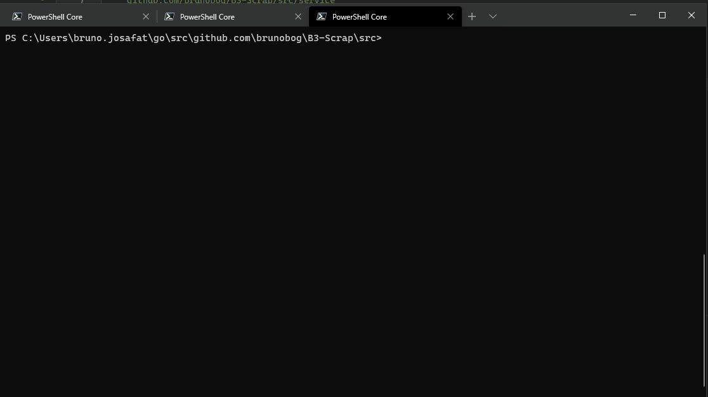

# B3-Scrap
Wrapper to get B3 indices from https://statusinvest.com.br/acoes website

- Use "go get" to download and install all project dependences
- this Repository has 2 "modes" 

# Console APP

  - to build a binary of console application you need go to /ConsoleApp and use go build acao.go
  - to run by source code: go run .\acao.go Stock_name
  - to run from binary type acao.exe ( or .bin if using linux) and a Stock_name like:
 

# API
- If you want a small API you can go to /APi and run or buila Api.go
- This API use port 8181 and has one endpoint
  - You can call this API by endpoint: localhost:8181/?stock=Stock_name
  - you will receive the same information on json.
